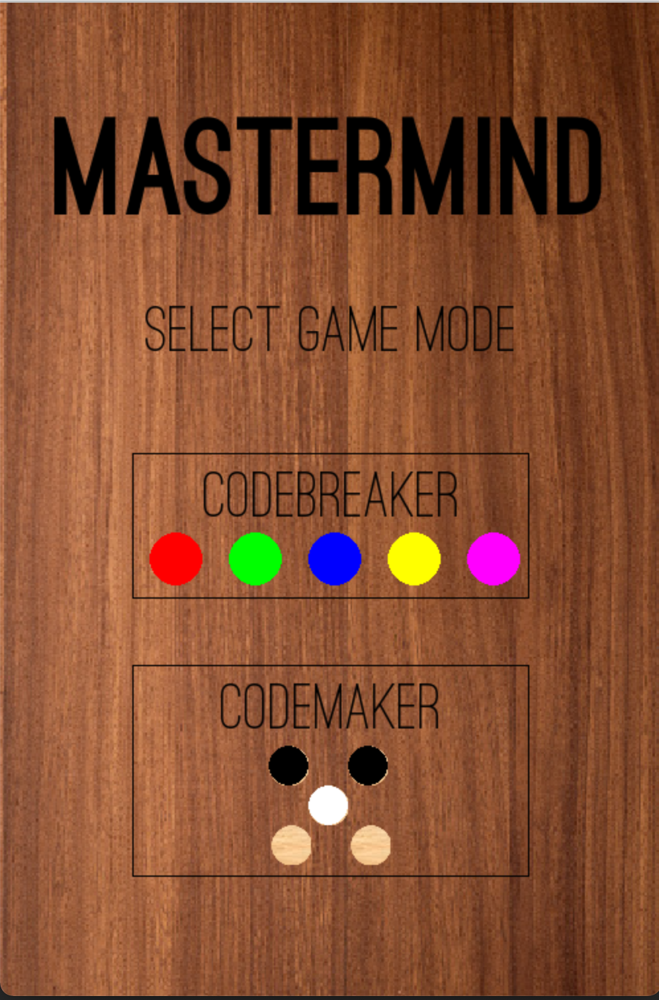

# Mastermind-Solver

This is a playable implementation of the code-cracking board game Mastermind. For the rules of Mastermind, see this [Wikihow article](https://www.wikihow.com/Play-Mastermind). This Mastermind board is different from the typical one since it has 5 holes and 5 colors, giving 3,125 possible combinations. The original Mastermind board has 4 holes and 6 colors, giving 1,296 possible combinations. I made this change since the physical Mastermind game I own has 5 holes and 5 colors.

  

As you can see above, you'll have the option of playing either the codebreaker or the codemaker. If you choose to be the codebreaker, you'll have to decode a random secret combination chosen by the computer. If you choose to be the codemaker, you will choose the random combination for the computer to guess. 

The computer is a very tough opponent, as it was written with an implementation of [Donald Knuth's Five Guess Algorithm](https://www.cs.uni.edu/~wallingf/teaching/cs3530/resources/knuth-mastermind.pdf). It will always find the correct answer in six guesses or less. This is one more guess than Knuth's original algorithm, but makes sense considering that this version of Mastermind has 1,829 more potential answers than the original Mastermind. On average, the computer takes 4.44 guesses to find the correct answer.

  

## Setup

In order to run this code, I would clone the entire repo and then run game_pg.py. ~~If you're running it for the first time, it will take about a minute to start up since the game needs to build and save a massive dictionary of all possible guess-answer combinations.~~ 

I built a lookup table instead so that the computer's answers would load instantly.

## References

- Obviously the paper by Donald Knuth I mentioned above is essential.

- This [fantastic presentation](https://www.youtube.com/watch?v=Okm_t5T1PiA) and [repo](https://github.com/agfor/talks/tree/master/beating_mastermind) by Adam Forsyth. He gives a great explanation of how the 5 guess algorithm works. His code is definitely cleaner than mine as well. I think the primary benefit of my code is that it provides an interactive visualization of the game and algorithm.
